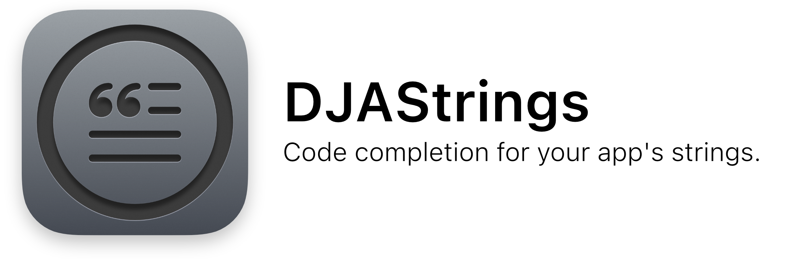

[](https://swift.org/)   [](LICENSE)

DJAStrings is a command line utility for generating Swift constants and functions to simplify the usage of localised strings sourced from String Catalogs in your Apple-platform projects.

## Examples

Consider the following set of simple localisations:


DJAStrings will use these localisations to produce Swift symbols that allow you to access your localisations as follows:

```swift
import UIKit

final class WelcomeViewController: UIViewController {
    override func viewDidLoad() {
        super.viewDidLoad()
        title = DJAStrings.welcomeTitle
        bodyLabel.text = DJAStrings.welcomeBody("John")
    }
}
```

The above code sets the view controller's title to "Welcome!", and the body label's text to "Hello, John". This removes the need to manually input localised string keys in to our code. Instead, we have generated code to do it for us, and our calls are type checked by the Swift compiler to ensure we pass the correct number and type of parameters for localised strings containing placeholders.

We can also gain improved code completion suggestions by adding namespaces to our localised string keys. Any `.` characters in a localisation key are interpreted as namespace delimiters. Consider if we change our String Catalog to look like this:


Note the `.` after "welcome", which will give us an extra `Welcome` namespace at the call site in our code:

```swift
import UIKit

final class WelcomeViewController: UIViewController {
    override func viewDidLoad() {
        super.viewDidLoad()
        title = DJAStrings.Welcome.title
        bodyLabel.text = DJAStrings.Welcome.body("John")
    }
}
```

This allows Xcode to narrow down the suggestions when providing code completion:


Localisations with multiple plural variations also gain named parameter support. For example, let's see what happens when we add the following localisation for showing the number of new messages stored in a number of inboxes:


This generates a function with parameters named using the same names as the placeholders from the String Catalog:

```swift
messagesLabel.text = DJAStrings.Welcome.newMessages(messageCount: 5, inboxCount: 2)
```


### Inline Documentation

DJAStrings generates documentation for your localisations, which is displayed inline by Xcode. Consider the following localisation, which varies based on the user's device:


Xcode surfaces these variations inside its documentation viewer:


For customisation options, see [Usage](#Usage).

## Installation

To install DJAStrings, follow these steps:

1. [Find the latest release from the GitHub release page](https://github.com/darjeelingsteve/DJAStrings/releases/latest).
2. Download the zip file attached to the release, which contains a built binary of DJAStrings.
3. Unzip the downloaded file, and put the resultant DJAStrings binary inside your project's directory.

By checking in the pre-built DJAStrings binary to your project's repository, you will save on build time that may be incurred if using a package manager, and ensure that all members of your team are using the same version of DJAStrings.

## Build Process Integration

Having followed the [installation instructions](#Installation), add a Run Script Action to the scheme used to build you app:


In this action, call the `djastrings` binary, passing parameters as described in the [Usage](#Usage) section:


This will cause the generated Swift file to be created before your build process begins, ensuring that its symbols are available when compilation begins. Don't forget to select your app's target for the "Provide build settings from" setting if you require access to your target's build settings when determining input and output paths to be passed to `DJAStrings`.

After building, add the generated Swift file to your Xcode project (it will be written in the directory given by the `-o` parameter, or in the directory from which the command is run if no path is given). You may also add the generated file to your `.gitignore` as it is automatically generated during building.

## Usage

The DJAStrings tool supports several options, allowing its behaviour to be customised. These are as follows:

#### `--top-level-localisation-namespace (shorthand: -t)`

The default value for this parameter is `"DJAStrings"`. If you pass a value, it will be used as the top-level namespace in the code generated by DJAStrings. For example if you pass `-t MyStrings`, you would access localisations as follows:

```swift
label.text = MyStrings.Welcome.title
```

The top-level namespace will also be used as the name of the generated Swift file i.e MyStrings.swift.

#### `--includes-table-name-namespaces (shorthand: -i)`

A flag that determines whether or not to include localisation table names as namespaces in the output Swift source file. Defaults to `false`. Only use this option if you have multiple String Catalogs that contain localisations with overlapping keys i.e the same key appears in more than one String Catalog.

#### `--output-directory (shorthand: -o)`

Specifies the path to the directory where the Swift file generated by DJAStrings will be written. The default value is the current working directory.

#### `--formatting-configuration-file-path (shorthand: -h)`

DJAStrings uses [swift-format](https://github.com/apple/swift-format) to ensure consistent formatting of the Swift source that it generates. If you wish to customise this formatting, pass a path to a [swift-format configuration file](https://github.com/apple/swift-format/blob/main/Documentation/Configuration.md).
